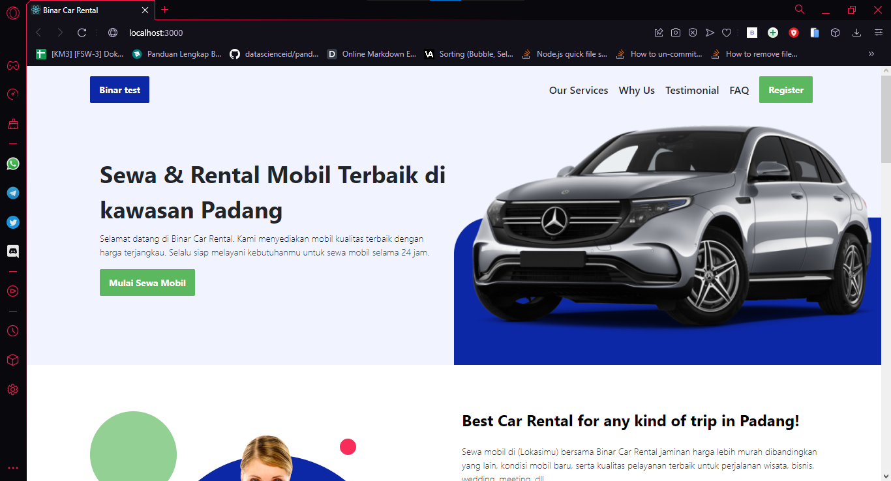
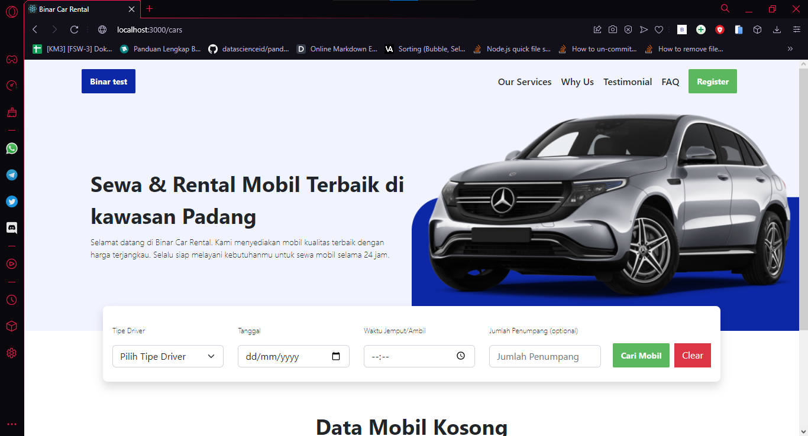

# Binar Car Rental

Nanda Julian Lubis.

Binar car rental is an implementation of challenge 02 binar, contains a landing page that contains an introduction to car rental binar and a car search page that contains car data, can be filtered by type of driver, date, time available and passenger capacity

## Features

- landing page
- search car by filter

## Tech

in this project, i use tech including::
- ReactJS

and some library / framework :
- Bootstrap - CSS Framework
- Owl Carousel - Carousel Library

list of page :
- "localhost:3000/" = landing page

- "localhost:3000/cars" = search car

## How to install project
- Download or clone the repository
- install dependencies with "npm install"
- run "npm start" to start project

##### Thank's for your visit